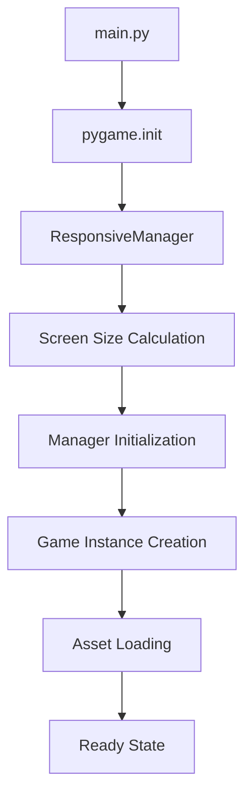
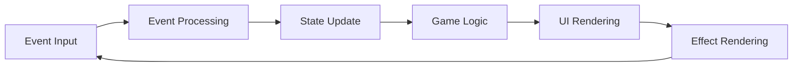
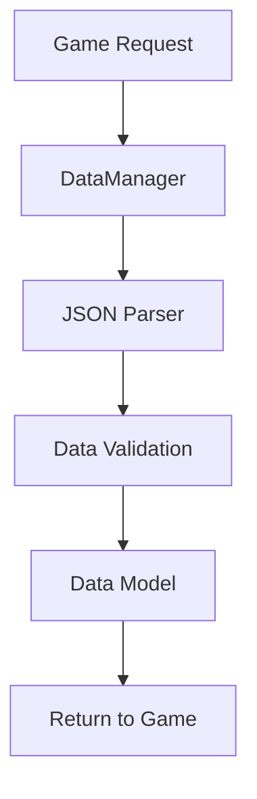

# アーキテクチャドキュメント

## システムアーキテクチャ概要

AWS Typing Gameは、**マネージャーパターン**と**レイヤードアーキテクチャ**を組み合わせた設計により、高い保守性と拡張性を実現しています。

## アーキテクチャダイアグラム

```
┌─────────────────────────────────────────────────┐
│                 Application Layer                │
│                   (main.py)                     │
│              ┌─ Event Handling ─┐               │
│              │ Game Loop & State │               │
│              └───────────────────┘               │
└─────────────────────┬───────────────────────────┘
                      │
┌─────────────────────┴───────────────────────────┐
│                Manager Layer                     │
├─────────────────┬───────────────┬───────────────┤
│   UI Manager    │ Audio Manager │ Data Manager  │
│ ┌─────────────┐ │ ┌───────────┐ │ ┌───────────┐ │
│ │ Responsive  │ │ │ Animation │ │ │Accessibility│ │
│ │ Font        │ │ │           │ │ │           │ │
│ └─────────────┘ │ └───────────┘ │ └───────────┘ │
└─────────────────┴───────────────┴───────────────┘
                      │
┌─────────────────────┴───────────────────────────┐
│                 Core Layer                       │
│  ┌─────────────┐  ┌─────────────┐  ┌──────────┐ │
│  │    Game     │  │   Config    │  │   Data   │ │
│  │   Logic     │  │  Constants  │  │  Models  │ │
│  └─────────────┘  └─────────────┘  └──────────┘ │
└─────────────────────────────────────────────────┘
                      │
┌─────────────────────┴───────────────────────────┐
│               External Layer                     │
│  ┌─────────────┐  ┌─────────────┐  ┌──────────┐ │
│  │   Pygame    │  │   Assets    │  │   JSON   │ │
│  │  (Graphics) │  │(Audio/Image)│  │ (Data)   │ │
│  └─────────────┘  └─────────────┘  └──────────┘ │
└─────────────────────────────────────────────────┘
```

## レイヤー別詳細

### 1. Application Layer (アプリケーション層)

**責務**: アプリケーション全体の制御とイベントハンドリング

#### `main.py`
```python
def main():
    # 1. システム初期化
    pygame.init()
    responsive_manager = ResponsiveManager()
    
    # 2. マネージャー初期化と依存関係注入
    managers = initialize_managers()
    
    # 3. ゲームループ
    while running:
        handle_events()
        update_state()
        render()
```

**主要責務**:
- システム初期化とシャットダウン
- マネージャー間の協調制御
- イベントルーティング
- ゲーム状態遷移の管理

### 2. Manager Layer (マネージャー層)

**責務**: 機能領域別の責務分離と専門化

#### UIマネージャー群
```python
# UI描画の責務分離
ui_manager = UIManager(screen, font_manager)
ui_manager.set_responsive_manager(responsive_manager)
ui_manager.set_accessibility_manager(accessibility_manager)
```

#### 音響マネージャー群
```python
# 音響制御の集約
audio_manager = AudioManager()
animation_manager = AnimationManager()
```

#### データマネージャー群
```python
# データアクセスの統一
data_manager = DataManager()
```

**設計原則**:
- **単一責務原則**: 各マネージャーは一つの機能領域を担当
- **依存関係注入**: 疎結合な設計
- **インターフェース統一**: 一貫したAPI設計

### 3. Core Layer (コア層)

**責務**: ビジネスロジックとゲーム固有の処理

#### ゲームエンジン設計
```python
class Game:
    def __init__(self, data_manager):
        self.game_state = "menu"  # 状態管理
        self.score = 0           # スコア計算
        self.current_word = ""   # タイピング対象
    
    def update(self, events, ignore_space):
        # ゲームロジックの更新
        self._handle_typing(events)
        self._update_score()
        self._check_time_limit()
```

#### 設定管理システム
```python
class GameConfig:
    TIME_LIMIT = 60
    TARGET_FPS = 60
    
class Colors:
    # アクセシビリティ対応カラーパレット
    PRIMARY = (52, 152, 219)
    
class EvaluationConfig:
    # スコア評価基準
    HERO_THRESHOLD = 80
```

### 4. External Layer (外部層)

**責務**: 外部リソースとライブラリの抽象化

#### Pygameラッパー
- 描画API の統一
- イベント処理の標準化
- 音響再生の制御

#### アセット管理
- ファイル読み込みの抽象化
- リソースの遅延読み込み
- エラーハンドリング

## データフロー

### 1. 初期化フロー



### 2. ゲームループフロー



### 3. データアクセスフロー



## スコアリングアーキテクチャ

### スコア計算式
```
Score = Accuracy Rate × WPM
```

### 精度計算ロジック
```python
def get_accuracy_rate(self) -> float:
    total_attempts = self.correct_chars + self.mistakes
    if total_attempts == 0:
        return 1.0
    return 1.0 - (self.mistakes / total_attempts)
```

### 評価レベル設計
```python
EVALUATION_LEVELS = {
    "Hero": 80,        # 完璧に近い精度 + 高速
    "Specialty": 60,   # 高精度 + 適度な速度
    "Professional": 45, # 良好な精度
    "Associate": 30,   # 基本レベル
    "Foundational": 0  # 開始レベル
}
```

## アクセシビリティアーキテクチャ

### 色覚サポート
```python
COLOR_BLIND_MODES = {
    "normal": 通常表示,
    "protanopia": 赤色覚異常対応,
    "deuteranopia": 緑色覚異常対応,
    "tritanopia": 青色覚異常対応
}
```

### キーボードナビゲーション
```python
ACCESSIBILITY_SHORTCUTS = {
    "F1": "色覚モード切替",
    "F2": "ハイコントラストモード",
    "F3": "効果音ON/OFF",
    "F4": "BGM ON/OFF"
}
```

## パフォーマンス設計

### レスポンシブ設計
```python
class ResponsiveManager:
    def __init__(self):
        self.scale_factor = self._calculate_optimal_scale()
    
    def scale_value(self, value: int) -> int:
        return int(value * self.scale_factor)
```

### メモリ管理
- 遅延読み込み（音響ファイル）
- キャッシュ戦略（フォント）
- リソース解放（ゲーム終了時）

### フレームレート最適化
```python
TARGET_FPS = 60
clock = pygame.time.Clock()
clock.tick(TARGET_FPS)
```

## エラーハンドリング戦略

### 階層別エラーハンドリング

#### 1. システムレベル
```python
try:
    pygame.init()
except pygame.error as e:
    # フォールバック処理
```

#### 2. マネージャーレベル
```python
try:
    audio_manager.load_sounds()
except Exception as e:
    print(f"Audio initialization warning: {e}")
    # 音響なしで継続
```

#### 3. ゲームレベル
```python
try:
    data_manager.load_aws_services()
except FileNotFoundError:
    # デフォルトデータで継続
```

## セキュリティ考慮事項

### 入力検証
- ファイルパス検証
- JSON入力サニタイゼーション
- ユーザー入力制限

### リソース保護
- ファイルアクセス制限
- メモリ使用量制御
- 例外処理による安全な終了

## テスト戦略

### ユニットテスト
```python
class TestGame:
    def test_accuracy_calculation(self):
        # スコア計算ロジックのテスト
```

### 統合テスト
```python
def test_manager_integration():
    # マネージャー間の連携テスト
```

### パフォーマンステスト
- フレームレート測定
- メモリ使用量監視
- レスポンシブ動作確認

## 拡張性設計

### プラグインアーキテクチャ（将来計画）
```python
class ManagerRegistry:
    def register_manager(self, name: str, manager_class):
        # 新しいマネージャーの動的登録
```

### データ拡張
```python
# 新しいAWSサービスの追加
{
    "service_name": "Amazon Bedrock",
    "category": "AI/ML",
    "sentence": "AI applications with Bedrock...",
    "translation": "Bedrockを使ったAIアプリケーション..."
}
```

### UI拡張
```python
class CustomUIManager(UIManager):
    def draw_custom_screen(self):
        # カスタム画面の追加
```

## まとめ

このアーキテクチャは以下の特徴を持ちます：

### 利点
- **保守性**: 明確な責務分離
- **拡張性**: プラグイン対応設計
- **テスタビリティ**: 依存関係注入
- **アクセシビリティ**: 包括的対応
- **パフォーマンス**: 最適化されたリソース管理

### 設計哲学
- **SOLID原則**: 単一責務、開放閉鎖原則
- **DRY原則**: 重複排除
- **KISS原則**: シンプルで理解しやすい設計

この設計により、教育的価値と技術的品質を両立した、持続可能な開発が可能になっています。